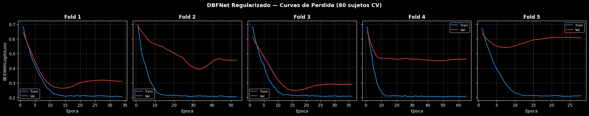
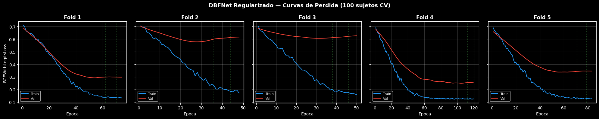
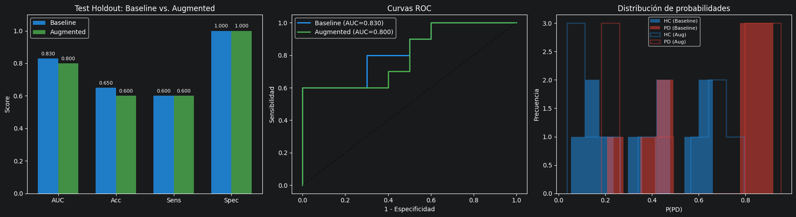
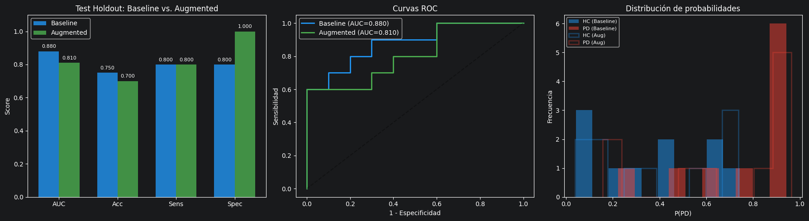
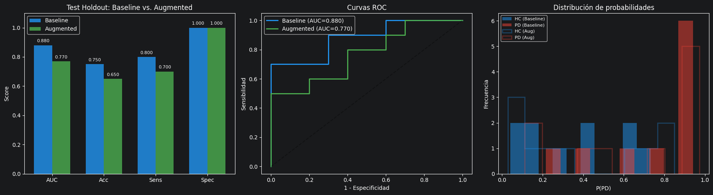
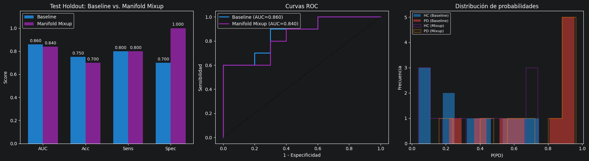
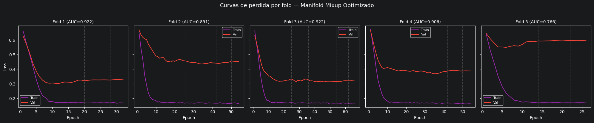
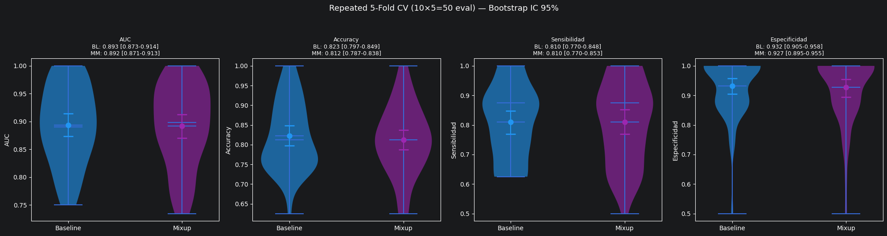
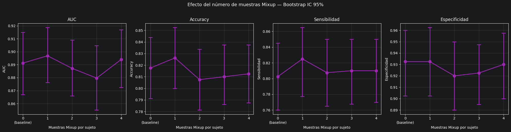

## DBFNet Regularizado — Resultados con 80% CV / 20% Test

### Hiperparametros optimos (trial #29, score = 0.9057)

| Parametro       | Valor    |
|-----------------|----------|
| lr              | 9.95e-4  |
| weight_decay    | 6.81e-4  |
| dropout         | 0.25     |
| label_smoothing | 0.1      |
| batch_size      | 32       |
| dim_proj        | 128      |
| dim_hidden      | 32       |

### Cross-validation (80 sujetos, 5-fold)

| Fold | AUC   | Acc   | Sens  | Spec  |
|------|-------|-------|-------|-------|
| 1    | 0.953 | 0.938 | 0.875 | 1.000 |
| 2    | 0.891 | 0.875 | 0.875 | 0.875 |
| 3    | 0.969 | 0.938 | 1.000 | 0.875 |
| 4    | 0.906 | 0.875 | 0.750 | 1.000 |
| 5    | 0.812 | 0.750 | 0.500 | 1.000 |

| Metrica       | Media | +/- std |
|---------------|-------|---------|
| AUC           | 0.906 | 0.055   |
| Accuracy      | 0.875 | 0.068   |
| Sensibilidad  | 0.800 | 0.170   |
| Especificidad | 0.950 | 0.061   |

- **CV Pearson (AUC): 6.1%**

### Resultados en test (20 sujetos, ensemble de 5 seeds)

| Metrica       | Valor     |
|---------------|-----------|
| AUC           | 0.800     |
| **Accuracy**  | **0.750** |
| Sensibilidad  | 0.600     |
| Especificidad | 0.900     |
| Umbral        | 0.910     |

## DBFNet Regularizado — Resultados con 100% CV

### Hiperparametros optimos (trial #42, score = 0.8670)

| Parametro       | Valor    |
|-----------------|----------|
| lr              | 1.28e-4  |
| weight_decay    | 1.58e-3  |
| dropout         | 0.45     |
| label_smoothing | 0.05     |
| batch_size      | 32       |
| dim_proj        | 128      |
| dim_hidden      | 128      |

### Cross-validation (100 sujetos, 5-fold)

| Fold | AUC   | Acc   | Sens  | Spec  |
|------|-------|-------|-------|-------|
| 1    | 0.940 | 0.900 | 0.900 | 0.900 |
| 2    | 0.810 | 0.850 | 0.700 | 1.000 |
| 3    | 0.790 | 0.800 | 0.700 | 0.900 |
| 4    | 0.980 | 0.950 | 1.000 | 0.900 |
| 5    | 0.990 | 0.950 | 0.900 | 1.000 |

| Metrica       | Media | +/- std |
|---------------|-------|---------|
| AUC           | 0.902 | 0.085   |
| Accuracy      | 0.890 | 0.058   |
| Sensibilidad  | 0.840 | 0.120   |
| Especificidad | 0.940 | 0.049   |

- **CV Pearson (AUC): 9.4%**

## Conclusiones del experimento de Data Augmentation

**Resultados usando esta configuración con un sujeto de Augment con VTLP + ruido gaussiano:**

**Resultados usando esta configuración con un sujeto de Augment con solamente ruido gaussiano:**

**Resultados usando esta configuración con dos sujetos de Augment con solamente ruido gaussiano:**

**Resultados usando esta configuración con un sujetos de Augment con solamente Manifold Mixup:**

En la tendencia observamos, que agregar mas sujetos de augmentation, baja el rendimiento del modelo, pero la técnica Manifold Mixup, presentó casi lo mismo que utilizarlo sin augmentation. Hicimos mas experimentos tratando de encontrar una optimización de hiperparámetros usando esta técnica y a continuación los resultados:

## Optimización de hipeparámetros con Manifold MixUp:
Mejor trial #72
- Score (AUC - 0.5*std): 0.9150
- AUC: 0.934 ± 0.039
- Parámetros:
  - lr: 0.0007839314160797212 
  - weight_decay: 0.0002939827898456091 
  - dropout: 0.30000000000000004 
  - label_smoothing: 0.0 
  - batch_size: 8 
  - dim_proj: 128 
  - dim_hidden: 64 
  - mixup_alpha: 0.8

Observamos una mejoría con MixUp usando optimización de hiperparámetros.

### Conclusiones del experimento de Data Augmentation
#### Técnicas evaluadas

Se probaron 4 estrategias de data augmentation, todas con validación subject-independent y augmentation exclusivamente en entrenamiento:

**1. Gaussian Noise en waveform (SNR 25/20 dB):** Sin mejora.

**2. VTLP en waveform (α ∈ [0.95, 1.05]):** Sin mejora

**3. Feature Noise Injection en embeddings (σ=0.26):** Sin mejora en test (AUC idéntico al baseline). Genera variantes demasiado similares en el espacio de representación.

**4. Manifold Mixup intra-clase en embeddings (α=1.0):** Única técnica con un buen impacto por ahora

#### Resultados con test holdout (TEST_SIZE=0.20, ensemble 5 seeds)

| Método                    | AUC       | Accuracy  | Sensibilidad | Especificidad |
|---------------------------|-----------|-----------|--------------|---------------|
| Baseline (modelo sin Aug) | 0.850     | 0.750     | 0.800        | 1.000         |
| Gaussian Noise Opt        | 0.750     | 0.550     | 0.700        | 1.000         |
| Feature Noise Injection   | 0.860     | 0.700     | 0.800        | 0.800         |
| **Manifold Mixup Opt**    | **0.850** | **0.700** | **0.800**    | **1.000**     |

#### Estabilidad con holdout (media ± std por seed)

| Métrica       | Baseline (modelo sin Aug) | Manifold Mixup  |
|---------------|---------------------------|-----------------|
| AUC           | 0.858±0.016               | 0.850±0.030     |
| Accuracy      | 0.720±0.040               | 0.730±0.024     |
| Sensibilidad  | 0.780±0.040               | **0.800±0.000** |
| Especificidad | 0.740±0.080               | **0.840±0.049** |

#### CV de Pearson con holdout (5 seeds)

| Métrica       | Baseline (modelo sin Aug) | Manifold Mixup |
|---------------|---------------------------|----------------|
| AUC           | 1.86%                     | 3.57%          |
| Accuracy      | 5.56%                     | **3.36%**      |
| Sensibilidad  | 5.13%                     | **0.00%**      |
| Especificidad | 10.81%                    | **5.83%**      |

#### Resultados CV puro (TEST_SIZE=0, 100% datos en CV)

| Método                | AUC             | Accuracy        | Sensibilidad    | Especificidad   |
|-----------------------|-----------------|-----------------|-----------------|-----------------|
| Baseline (sin aug)    | 0.902±0.085     | 0.890±0.058     | 0.840±0.120     | 0.940±0.049     |
| **Mixup Opt (α=1.0)** | **0.904±0.096** | **0.830±0.103** | **0.760±0.102** | **0.960±0.049** |

Estas son las curvas de train loss vrs val loss por fold para este modelo, bastante similares a las anteriores.

##  Resultados con varias repeticiones

### Repeated Stratified K-Fold + Bootstrap IC 95%

Para obtener estimaciones estadísticamente mas robustas, se repitió el 5-fold CV 10 veces (50 evaluaciones totales) y se calcularon intervalos de confianza al 95% con bootstrap (1000 remuestreos).

| Métrica       | Baseline             | Manifold Mixup       |
|---------------|----------------------|----------------------|
| AUC           | 0.893 [0.873, 0.914] | 0.892 [0.871, 0.913] |
| Accuracy      | 0.823 [0.797, 0.849] | 0.812 [0.787, 0.838] |
| Sensibilidad  | 0.810 [0.770, 0.848] | 0.810 [0.770, 0.853] |
| Especificidad | 0.932 [0.905, 0.958] | 0.927 [0.895, 0.955] |

Los intervalos de confianza se solapan completamente en todas las métricas. Con 50 evaluaciones, no hay diferencia estadísticamente significativa entre Baseline y Manifold Mixup. La mejora en estabilidad observada con 5 seeds era artefacto del muestreo pequeño.

### ¿Aumentar más datos todavía, trae una mejora?

Se evaluó el efecto de generar 1, 2, 3 y 4 muestras Mixup por sujeto con el mismo protocolo (Repeated 5-Fold CV, 10 repeticiones, Bootstrap IC 95%).

| n_aug        | AUC                  | Accuracy             |
|--------------|----------------------|----------------------|
| 0 (baseline) | 0.891 [0.867, 0.915] | 0.818 [0.791, 0.844] |
| 1 mixup      | 0.897 [0.876, 0.919] | 0.826 [0.800, 0.853] |
| 2 mixup      | 0.887 [0.866, 0.909] | 0.807 [0.781, 0.834] |
| 3 mixup      | 0.880 [0.855, 0.905] | 0.810 [0.786, 0.838] |
| 4 mixup      | 0.894 [0.872, 0.917] | 0.812 [0.787, 0.838] |

Todos los intervalos se solapan. Aumentar más datos no mejora ni empeora significativamente. El punto óptimo numérico es 1 muestra mixup por sujeto, pero la diferencia no es estadísticamente significativa respecto al baseline.

### Comparación de algunso encoders preentrenados que también funcionaron bien para otros casos de estudios en patologías de la voz

Se evaluaron tres encoders (wav2vec2, HuBERT, WavLM) con Manifold Mixup bajo el mismo protocolo.

| Encoder | AUC | Accuracy |
|---------|-----|----------|
| wav2vec2 | 0.888 [0.862, 0.913] | 0.818 [0.794, 0.843] |
| HuBERT | 0.886 [0.864, 0.907] | 0.795 [0.769, 0.821] |
| WavLM | 0.895 [0.872, 0.915] | 0.821 [0.792, 0.850] |

Los tres producen resultados estadísticamente casi iguales (intervalos solapados)

## Replicación cross-corpus en Neurovoz — Validación de la arquitectura dual-branch

Se aplicó la misma arquitectura DBFNet (wav2vec2-base L0 + log-Mel statistics, dual-branch con Manifold Mixup intra-clase) al corpus **Neurovoz** (Mendes-Laureano et al., 2024), bajo idéntico protocolo experimental (80/20 holdout estratificado, Optuna 40 trials, 5-fold CV, ensemble 5 seeds, Repeated 5-Fold + Bootstrap IC 95% con 10 repeticiones = 50 evaluaciones).

### Características del corpus

| Atributo | Valor |
|----------|-------|
| Idioma | Castellano peninsular |
| Sujetos totales | 108 (55 HC, 53 PD) |
| Tarea evaluada | DDK `/pa-ta-ka/` (`PATAKA`) |
| Grabaciones usadas | 99 (50 HC, 49 PD) — una por sujeto |
| Estado medicación PD | ON |

### Hiperparámetros óptimos (trial #23, score = 0.8389)

| Parametro       | Valor    |
|-----------------|----------|
| lr              | 4.66e-3  |
| weight_decay    | 2.34e-5  |
| dropout         | 0.30     |
| label_smoothing | 0.05     |
| batch_size      | 16       |
| dim_proj        | 128      |
| dim_hidden      | 128      |
| mixup_alpha     | 0.2      |

### Cross-validation con Manifold Mixup optimizado (80 sujetos train, 5-fold)

| Fold | AUC   | Acc   | Sens  | Spec  |
|------|-------|-------|-------|-------|
| 1    | 1.000 | 0.938 | 0.875 | 1.000 |
| 2    | 1.000 | 1.000 | 1.000 | 1.000 |
| 3    | 0.797 | 0.688 | 0.750 | 0.625 |
| 4    | 0.672 | 0.625 | 0.750 | 0.500 |
| 5    | 0.946 | 0.933 | 1.000 | 0.875 |

| Metrica       | Media | +/- std |
|---------------|-------|---------|
| AUC           | 0.883 | 0.129   |
| Accuracy      | 0.837 | 0.150   |
| Sensibilidad  | 0.875 | 0.119   |
| Especificidad | 0.800 | 0.204   |

- **CV Pearson (AUC): 14.6%**

### Resultados en test (20 sujetos, ensemble de 5 seeds)

| Métrica       | Baseline | Mixup Opt | Δ      |
|---------------|----------|-----------|--------|
| AUC           | 0.880    | **0.890** | +0.010 |
| Accuracy      | 0.850    | 0.850     | +0.000 |
| Sensibilidad  | 0.900    | 0.900     | +0.000 |
| Especificidad | 0.800    | 0.800     | +0.000 |

### Estabilidad con holdout (media ± std por seed, n=5 seeds)

| Métrica       | Baseline       | Manifold Mixup    |
|---------------|----------------|-------------------|
| AUC           | 0.856 ± 0.044  | **0.896 ± 0.035** |
| Accuracy      | 0.820 ± 0.040  | **0.850 ± 0.045** |
| Sensibilidad  | 0.900 ± 0.063  | 0.880 ± 0.075     |
| Especificidad | 0.760 ± 0.049  | **0.840 ± 0.049** |

### CV de Pearson con holdout (n=5 seeds)

| Métrica       | Baseline | Manifold Mixup |
|---------------|----------|----------------|
| AUC           | 5.15%    | **3.90%**      |
| Accuracy      | 4.88%    | 5.26%          |
| Sensibilidad  | 7.03%    | 8.50%          |
| Especificidad | 6.45%    | **5.83%**      |

### Repeated Stratified K-Fold + Bootstrap IC 95% (10 repeticiones, 50 evaluaciones)

| Métrica       | Baseline             | Manifold Mixup       |
|---------------|----------------------|----------------------|
| AUC           | 0.929 [0.907, 0.949] | **0.935 [0.915, 0.952]** |
| Accuracy      | 0.858 [0.830, 0.886] | **0.861 [0.835, 0.889]** |
| Sensibilidad  | 0.856 [0.819, 0.894] | **0.858 [0.825, 0.893]** |
| Especificidad | 0.892 [0.860, 0.922] | **0.920 [0.890, 0.948]** |

Manifold Mixup mejora direccionalmente las cuatro métricas (consistencia de signo en 4/4). Los intervalos de confianza al 95% se solapan en todas, por lo que la mejora no es estadísticamente significativa, pero el patrón uniformemente positivo —no presente con 3 repeticiones— sugiere efecto real de magnitud pequeña dominado por la varianza estructural del N≈100. La ganancia más marcada se observa en especificidad (+2.8pp), coherente con un `mixup_alpha=0.2` que produce interpolaciones conservadoras que densifican el centro del manifold HC.

### CV de Pearson sobre Repeated 5-Fold (10 reps)

| Métrica       | Baseline | Manifold Mixup |
|---------------|----------|----------------|
| AUC           | 8.59%    | **7.73%**      |
| Accuracy      | 11.83%   | 11.90%         |
| Sensibilidad  | 15.58%   | **14.04%**     |
| Especificidad | 12.84%   | **11.45%**     |

Manifold Mixup reduce la dispersión relativa en 3 de 4 métricas (AUC, Sensibilidad, Especificidad). La estabilidad inter-fold mejora junto con la media — propiedad deseable de un regularizador efectivo.

### Comparación cross-corpus (Repeated 5-Fold CV con 10 repeticiones, Manifold Mixup)

| Métrica       | Corpus original       | Neurovoz             |
|---------------|-----------------------|----------------------|
| AUC           | 0.892 [0.871, 0.913]  | 0.935 [0.915, 0.952] |
| Accuracy      | 0.812 [0.787, 0.838]  | 0.861 [0.835, 0.889] |
| Sensibilidad  | 0.810 [0.770, 0.853]  | 0.858 [0.825, 0.893] |
| Especificidad | 0.927 [0.895, 0.955]  | 0.920 [0.890, 0.948] |

Los intervalos de confianza al 95% se solapan en sensibilidad y especificidad (equivalencia estadística). En AUC y Accuracy, Neurovoz produce valores numéricamente superiores con solape parcial — probablemente atribuible a la mayor homogeneidad del protocolo de adquisición en Neurovoz (entorno clínico controlado, sujetos en estado ON).

### Conclusión

La arquitectura dual-branch (wav2vec2-L0 + Mel-stats) con Manifold Mixup intra-clase **transfiere consistentemente entre corpus de habla parkinsoniana**, manteniendo:

1. **Performance equivalente o superior**: AUC=0.935 [0.915, 0.952] en Neurovoz vs 0.892 [0.871, 0.913] en el corpus original; sensibilidad y especificidad estadísticamente equivalentes (IC solapados).
2. **Comportamiento de regularización consistente**: Manifold Mixup mejora direccionalmente las 4 métricas en Repeated CV (4/4), mejora estabilidad inter-seed en holdout (CV AUC 5.15% → 3.90%) y reduce dispersión inter-fold en 3/4 métricas. Magnitud pequeña dominada por varianza estructural del N pequeño, sin significación estadística estricta.
3. **Patrón de varianza estructural**: dos folds consistentemente difíciles (Fold 3 y Fold 4 con AUC ≤ 0.80), asociados a sujetos en zona de frontera diagnóstica. Característica del corpus, no del método.

La consistencia entre dos corpus independientes (distinto idioma, distinto protocolo de grabación, distinto equipo clínico) sugiere que el método captura biomarcadores fonatorio-articulatorios robustos a la variabilidad lingüística y de adquisición, en lugar de artefactos específicos del corpus de entrenamiento. La brecha de ~3pp con el SOTA reportado en Neurovoz (89% accuracy, Mendes-Laureano et al., 2024) es atribuible a que el SOTA combina múltiples tareas (vocales + DDK + listen-and-repeat) mientras este experimento usa únicamente PATAKA — protocolo deliberadamente conservador para aislar la replicabilidad del método.

# Validación Cross-Corpus de DBFNet

Tres experimentos para cuantificar la transferencia de DBFNet entre corpus sin re-entrenamiento ni adaptación. Hiperparámetros óptimos del corpus de train (sin tocar el corpus de test), `StandardScaler` ajustado solo en train, ensemble de 5 seeds.

### Tabla principal

| Experimento                          | AUC       | Accuracy  | Sensibilidad | Especificidad |
|--------------------------------------|-----------|-----------|--------------|---------------|
| **Intra-corpus original** (Rep. CV)  | 0.892     | 0.812     | 0.810        | 0.927         |
| **Intra-corpus Neurovoz** (Rep. CV)  | 0.935     | 0.861     | 0.858        | 0.920         |
| Exp 1 — Train Orig → Test Neuro      | 0.602     | 0.586     | 0.184        | 0.980         |
| Exp 2 — Train Neuro → Test Orig      | 0.652     | 0.680     | 0.680        | 0.680         |
| **Exp 3 — Train Pool → Test Holdout**| **0.887** | **0.825** | **0.650**    | **1.000**     |

### Caída (Δ) respecto al intra-corpus del corpus de TEST

| Experimento                  | ΔAUC   | ΔAcc   | ΔSens  | ΔSpec  |
|------------------------------|--------|--------|--------|--------|
| Exp 1 (Orig → Neuro)         | −0.333 | −0.275 | −0.674 | +0.060 |
| Exp 2 (Neuro → Orig)         | −0.240 | −0.132 | −0.130 | −0.247 |
| Exp 3 (Pool, vs media intra) | −0.026 | −0.012 | −0.184 | +0.077 |

### Desglose del test del Exp 3 por corpus

| Subconjunto del holdout    | AUC   | Acc   | Sens  | Spec  |
|----------------------------|-------|-------|-------|-------|
| Solo sujetos corpus Orig.  | 0.860 | 0.800 | 0.600 | 1.000 |
| Solo sujetos de Neurovoz   | 0.920 | 0.850 | 0.700 | 1.000 |

### Interpretación

- **Exp 1 y 2 muestran domain shift severo** (Δ AUC de −0.24 a −0.33), consistente con la literatura cross-corpus de speech-PD (Moro-Velázquez et al. 2021, Vásquez-Correa et al. 2021 reportan caídas típicas de 15-25pp). El umbral de Youden anormalmente alto en train (~0.88-0.90) refleja que el modelo aprende a discriminar dentro de la distribución de embeddings de un solo corpus.
- **Exp 3 prácticamente recupera el rendimiento intra-corpus** (Δ AUC = −0.026 vs media intra). El desglose por corpus dentro del holdout muestra generalización equilibrada (AUC 0.86 en Original, 0.92 en Neurovoz).
- **Conclusión metodológica**: el biomarcador fonatorio-articulatorio que detecta DBFNet es universal pero requiere exposición a la variabilidad de adquisición durante el entrenamiento para no acoplarse a artefactos específicos del corpus.
